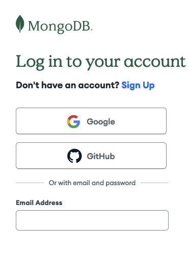
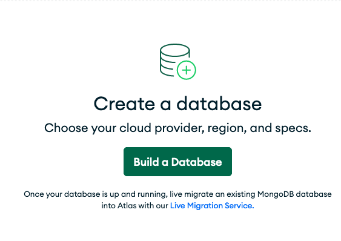
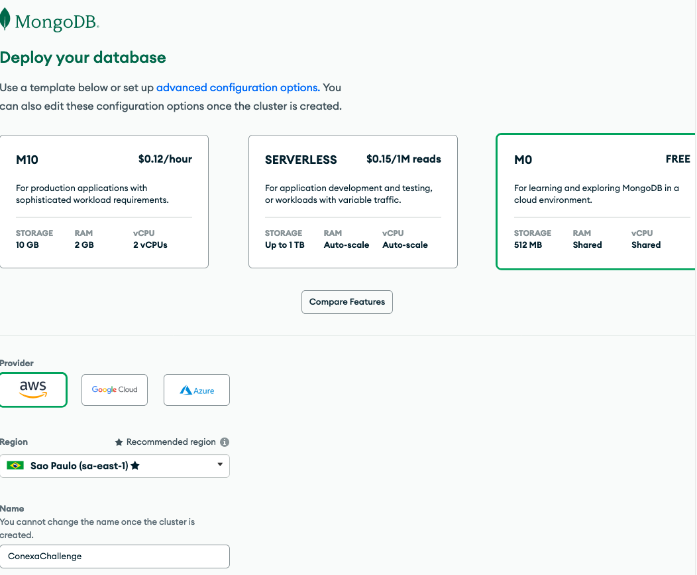
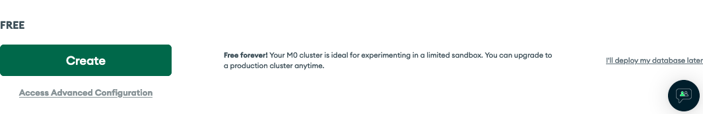
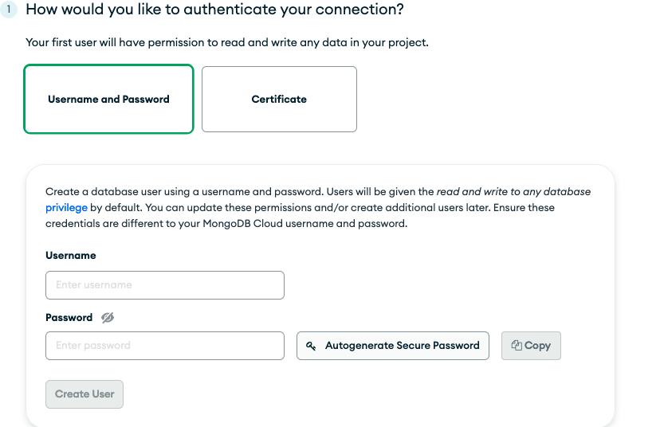
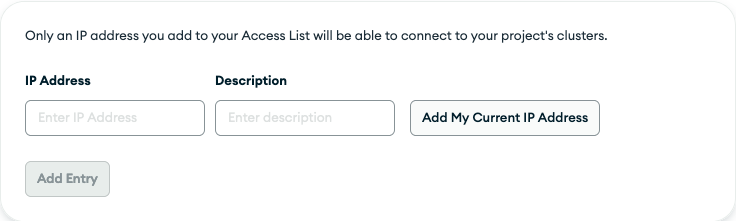
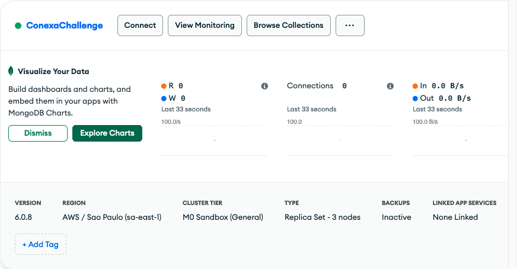
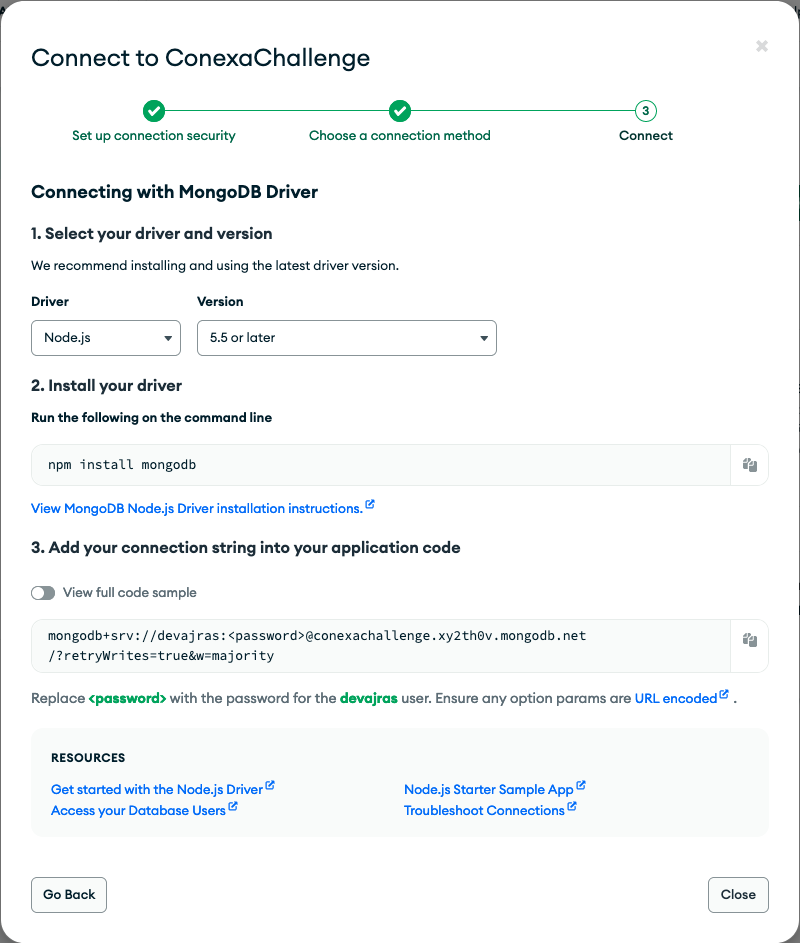

# SOBRE LA APP

Es una API que a su vez consume la api de star wars, SWAPI, de la cual obtiene las peliculas de la saga y sus detalles. Ademas puedes agregar o eliminar peliculas si lo deseas desde un usuarios admin.
Es recomendable que el primer endpoint a consultar luego de crear tu usuario admin sea:

POST /movies/load-api-movies

Ya que este populara la base con las peliculas obtenidas de **SWAPI**

# ENDPOINTS

Contamos con 3 tipos de endpoints:

- Publicos.
- Para usuarios regulares.
- Para admins.

PUBLICOS:

- POST /users/register : Creacion de usuario regular, require email y password.

- POST /users/register-admin: Creacion de usuario admin, require email y password.

- POST /user/login: Login de usuario, retorna token JWT de autenticacion, requiere email y password.

- GET /movies : Retorna las peliculas que se encuentran almacenadas en la base de datos.

PARA USUARIOS REGULARES:

- GET /movies/:id: Retorna toda la info disponble sobre la pelicula del id que fue pasado por parametro.

PARA USUARIOS ADMIN:

- POST /movies/load-api-movies: Chequea si las peliculas de SWAPI se encuentran almacenadas en la db, de faltar alguna las guarda en la base de datos.

- POST /movies/add: Agregar una pelicula a la base de datos, requiere pasar por body en formato json por lo menos el title de la pelicula a almacenar, el resto de los campos es opcional.

- PATCH /movies/:id: Modificar una pelicula existente, se pasa por parametro el id y por el body en formato json las propiedades a modificar.

- DELETE /movies/:id: Eliminar una pelicula de la base de datos, se pasa por parametro el id de la pelicula a eliminar.

# requisitos para iniciar el proyecto de manera local:

- Necesitas tener instalado npm y por consecuente node (podes descargarlo desde **https://nodejs.org/**).
- Necesitas unar url de mongo-atlas para poder conectarte a una base de datos cloud (explicacion mas adelante).

PASOS PARA INSTALAR EL PROYECTO:

1 - Realizar un git clone de ester repositorio.

2 - npm install -> para instalar las dependencias correspondientes.

3 - Debemos completar las variables de entorno, modificamos el .env.example a .env:

PORT= El puerto donde queremos que se ejecute el proyecto.

SECRET_JWT= Es una palabra clave que utilizamos para completar la encriptacion con JWT.

BASE_URL_SW= https://swapi.dev/api/

y URL_MONGO= (a continuacion explicare como obtenerla).
UTILIZAREMOS MONGO CLOUD YA QUE NOS PERMITE CREAR UN CLUSTER GRATIS.

# como obtener nuestra url de mongo

1 - Nos dirigimos a: **https://account.mongodb.com/account/login** y nos logueamos.

2 - Hacemos click en build a database.

3 - Seteamos el cluster con estas opciones.

4 - Y finalizamos el proceso de creacion haciendo click en create.

5 - Seteamos un usuario y password para configurar en nuestra url.

6 - Muy importante agregar nuestra ip para poder comunicarnos correctamente con el cluster.

7 - Una vez visualizamos el cluster, hacemos click en connect.

8 - Elegimos la opcion por driver. y la opcion de coneccion numero 3: "Add your connection string into your application code."

9 - Remplazando <password> por la elegida anteriormente podemos pegar esa url en nuestro .env y la coneccion con el cluster desde la app ya puede ser realizada.
